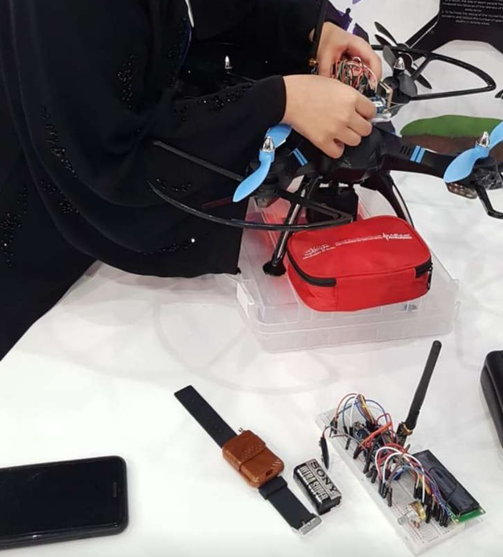
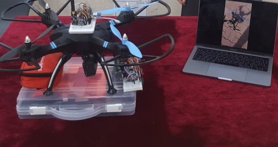
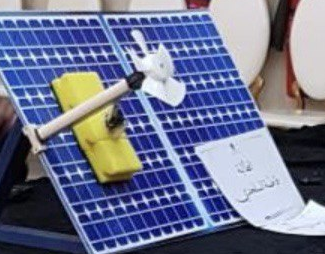
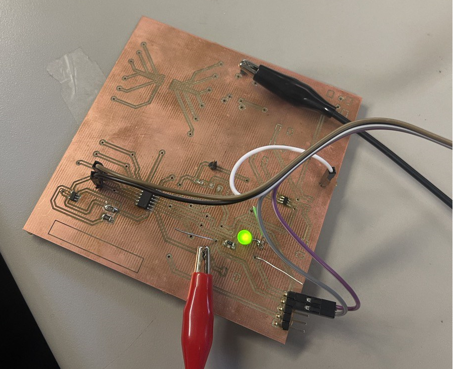

Greetings to all. My name is Fatema Ahmed Alsalhadi and I am currently a
student at Arizona State University, where I am pursuing a degree in
Robotics Engineering. I have always possessed a strong passion for
innovation, technology, and robotics. Furthermore, I got awarded the
title of ambassador of innovation and ambassador of sustainability. In
addition, I am proud to be the first Emirati female to join the
St. Andrews Summer school program. Throughout my academic journey, I pursued an Artificial Intelligence Diploma and I have
undertaken several projects that have revolved around robotics and
technology. These projects include,

**1.  A small robot that assists students and teachers in transferring
    books and supplements between school halls.**

**2.  A robot designed to detect and clean solar panels once a specific
    threshold of dustiness is reached.**

**3.  A drone equipped with a First Aid Kit and 360 cameras to aid in
    critical situations such as wars, fires, and for emergency
    responders.**

**4. Designing and building PCBs projects, I have solid experience in Hardware Engineering and Research.** 

<figure class="image">  

  

   
 

</figure>

<figure class="image">  

  

   
 

</figure>

<figure class="image">  

  

   
 

</figure>

<figure class="image">  

  

   
 

</figure>
    

